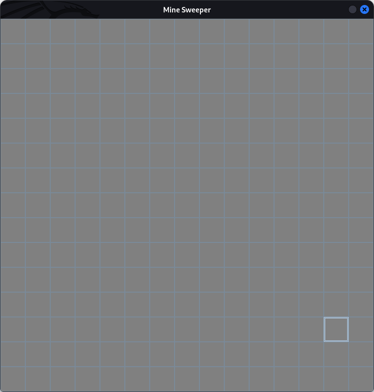
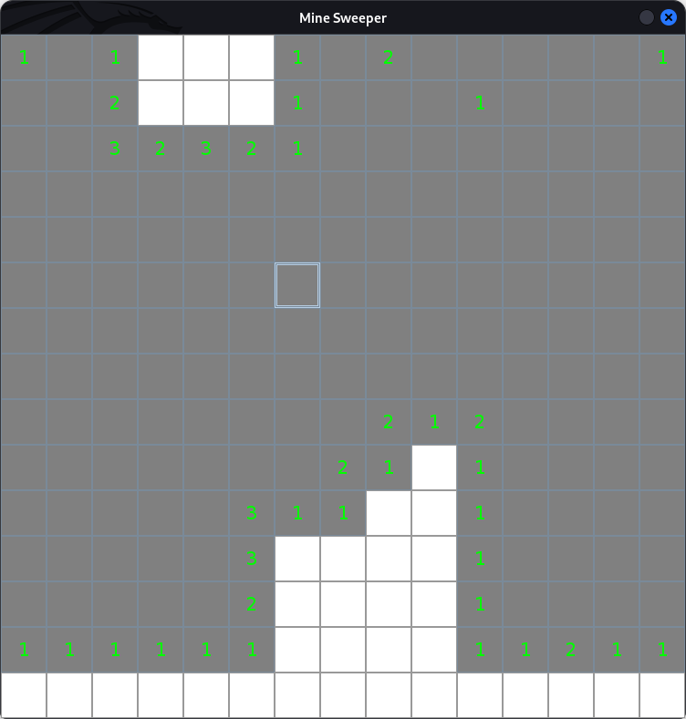
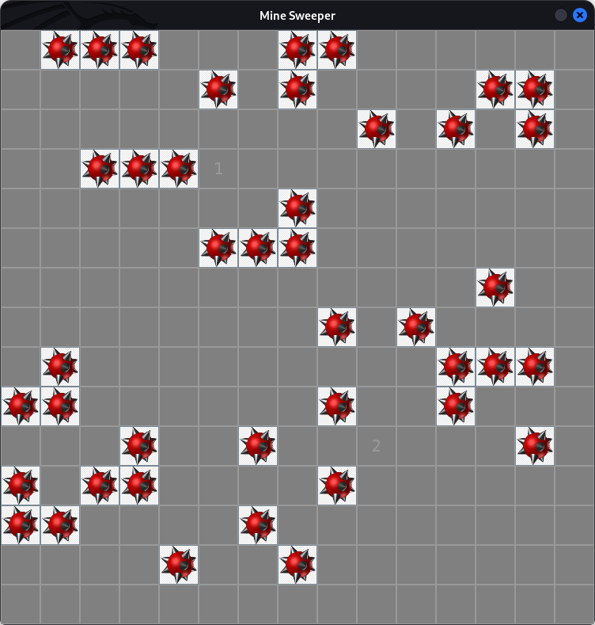

# mine-sweeper

This project is a swing implementation to the mine-sweeper game

## Notice

- Amount of bombs is equal to `amount of buttons / 5`
- Game restarts after 5 seconds of losing

## Demo

